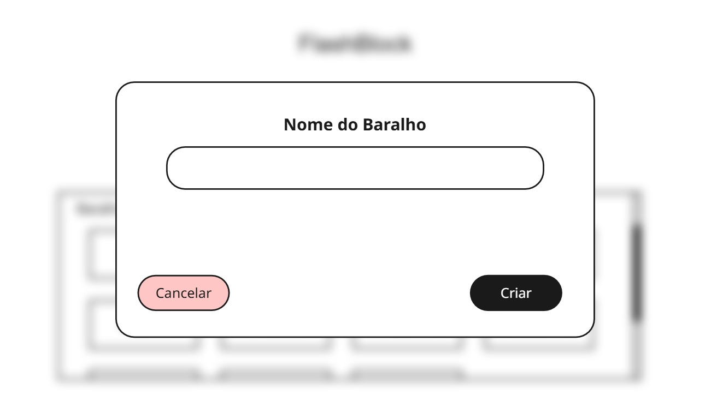
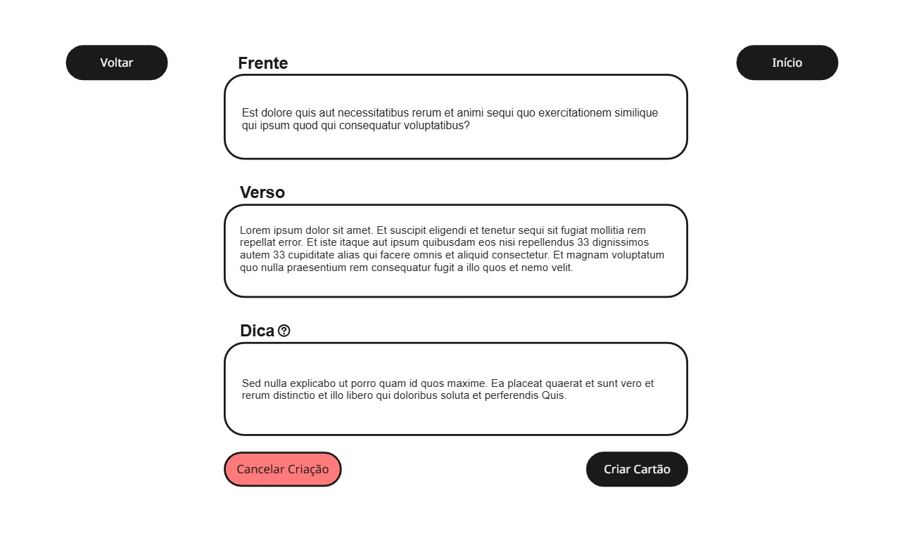
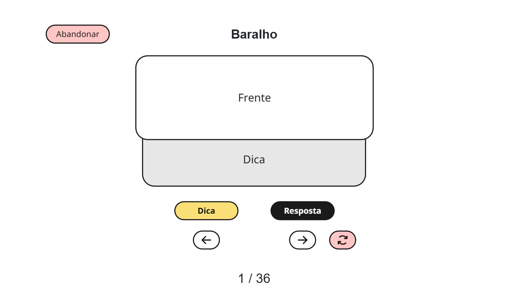

# FlashBlock v0.1 — Wireframes

Os wireframes definem a estrutura visual inicial das principais telas e interações da aplicação.

**ATENÇÃO!**: As imagens representam a estrutra das páginas e não refletem a versão final do projeto e design adotado.

## 1. Tela Inicial — Baralhos

Tela principal da aplicação.

**Elementos:**

* Botão **Criar Baralho**.
* Bloco **Baralhos Criados**, a estrutura atual permite que futuramente sejam adicionados mais recursos na página, evitando que os baralhos ocupem a página inteira.
* Exibição dos baralhos já existentes.
* Área destinada à navegação entre os baralhos.

**Objetivo:** permitir visualizar os baralhos existentes e iniciar a criação de um novo.

---

## 2. Tela de Criação de Baralho

A criação de um baralho ocorre por meio de um **pop-up/modal** sobre a tela inicial.

**Elementos:**

* Campo **Nome do Baralho**.
* Botão **Cancelar**.
* Botão **Criar**.

**Objetivo:** criar um novo baralho informando apenas seu nome.

---

## 3. Tela de Criação de Cartão

Tela utilizada para adicionar cartões ao baralho selecionado.

**Elementos:**

* Botão **Voltar/Início**.
* Botão **Cancelar criação**.
* Campo **Frente**.
* Campo **Verso**.
* Campo **Dica**.
* Botão **Criar Cartão**.

**Objetivo:** cadastrar o conteúdo necessário para um cartão.

---

## 4. Tela de Estudo

Tela principal de utilização dos cartões.

**Elementos:**

* Botão **Abandonar**.
* Nome do baralho.
* Área do cartão exibindo a **Frente**.
* Área de **Dica**, apresentada como um elemento semelhante a um *dropdown*.
* Botão **Dica**, faz a área *dica* será exibida.
* Botão **Resposta**.
* Botão de navegação para o **cartão anterior**.
* Botão de navegação para o **próximo cartão**.
* Botão para **reiniciar a pilha de cartões**.
* Indicador de progresso do total de cartões, apresentada de forma numérica.

**Objetivo:** permitir estudar os cartões do baralho, consultar dicas, revelar respostas e navegar pela sequência.
