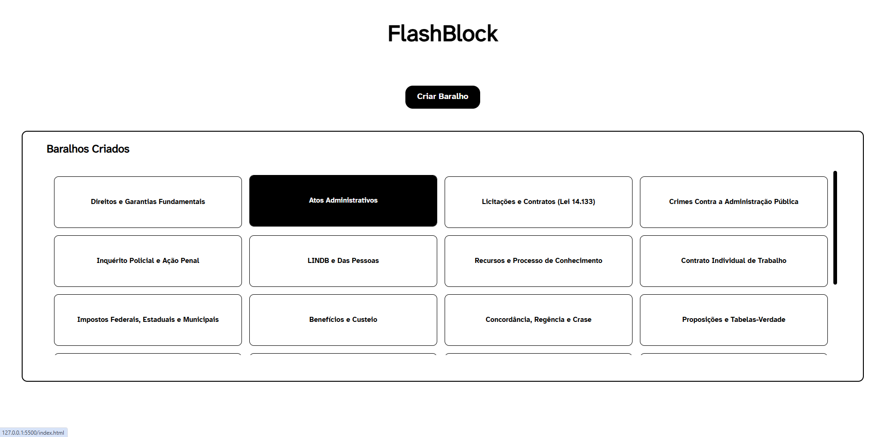
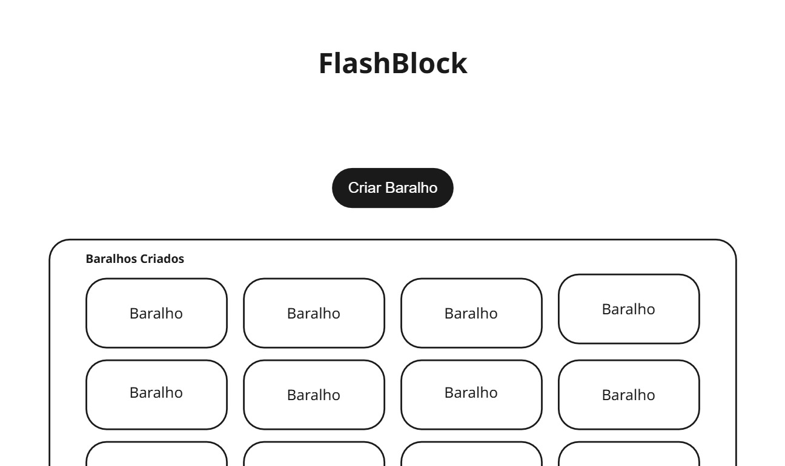

 # FlashBlock v0.1

 ## Atualizações

 ### Atualização de Tela Inicial

 #### **Mudança #0.0.1**

 Criada primeira versão de tela inicial do aplicativo, contemplando exemplos de visuais de como as listas de baralho serão posicionadas:

 
 
 *Versão Inicial de tela principal*

 ## Comparação com protótipo inicial:

 

 *Desenho de wireframe da tela inicial no planejamento*
 